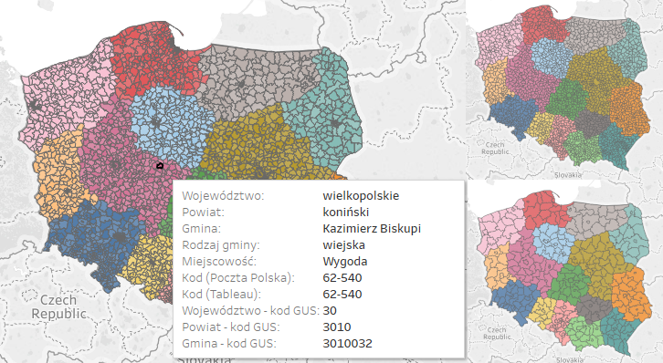

# Administrative division of Poland with zipcodes for Tableau

This project extends Tableau geocoding for Poland by adding Poczta Polska zipcodes (kody pocztowe) along with voivodeships (województwa), counties (powiaty) and communes (gminy). It also provides a lookup table in order to transform Poczta Polska zipcodes to those recognized by Tableau.

* [CODGiK](http://www.codgik.gov.pl/index.php/darmowe-dane/prg.html) state registry of borders: 2017-01-27
* [Poczta Polska](http://kody.poczta-polska.pl/) zipcodes: 2017-05-01
* [Tableau](https://www.tableau.com/) zipcodes: 10.2



## Requirements

 * Debian packages:
    * `build-essential`
    * `libproj-dev`
    * `libgeos-dev`
    * `libgdal-dev`
    * `unzip`
 * R 3.3 with `checkpoint` library (e.g. [Microsoft R Open](https://mran.microsoft.com/download/))
 * Tableau 10.2

Since this script uses [TabGeoHack](https://community.tableau.com/thread/146238), that is distributed as Windows program, [Windows Subsystem for Linux](https://msdn.microsoft.com/commandline/wsl/about) might be necessary. CPU with at least 8 cores is recommended.

Note: building can not be easily automated, because sometimes Tableau must be manually run in order to generate some files.

## Config

Variables in `tpad.sh`:

* `PATH_TABLEAU_REPOSITORY` - path to *My Tableau Repository* directory;
* `URL_TABGEOHACK` - URL to [TabGeoHack](https://community.tableau.com/thread/146238) utility ZIP;
* `URL_GDAL` -  URL to [Geospatial Data Abstraction Library](http://www.gdal.org/) ZIP used by [TabGeoHack](https://community.tableau.com/thread/146238);
* `URL_SHAPEFILES` - URL to shape files ZIP for administrative divisions distributed by [CODGiK](http://www.codgik.gov.pl/);
* `URL_PP_POBN` - URL to [Poczta Polska](http://www.poczta-polska.pl/) list of post-office box numbers;
* `R_CHECKPOINT_SNAPSHOT_DATE` - R checkpoint library snapshot date;
* `ADD_TABLEAU_ZIPCODES_TO_PP` - logical; add extra Tableau zipcodes that are not in Poczta Polska official zipcode list.

## Usage

```
$ ./tpad.sh [COMMAND-1] [COMMAND-2] ...
```

List of commands:

 * `check-requirements` - checks whether Debian packages and R are installed; processes R checkpoint library installation;
 * `get-shapefiles` - downloads shape files of administrative division;
 * `process-shapefiles` - transforms shape files to usable form and generates simplified CSV files;
 * `merge-ad-csv` - merges simplified administrative division CSV files;
 * `get-tabgeohack` - downloads TabGeoHack and Geospatial Data Abstraction Library;
 * `configure-tabgeohack` - configures TabGeoHack;
 * `tabgeohack-roles` - makes custom geocoding files stubs for Tableau;
 * `tabgeohack-shapes` - creates usable Tableau custom geocoding;
 * `get-pp-pob` - downloads post-office box numbers for Poczta Polska;
 * `extract-pp-pobn` - extracts post-office box numbers for Poczta Polska;
 * `crawl-pp-zipcodes` - crawls zipcodes for Poczta Polska;
 * `combine-pp` - combines zipcodes with administrative division;
 * `make-zipcodes-lookup` -  makes *Poczta Polska to Tableau* zipcode lookup table.

### Example

Performs all operations (note that error detection is limited; thus, sequential run is recommended):

```
$ ./tpad.sh check-requirements get-shapefiles process-shapefiles merge-ad-csv get-tabgeohack configure-tabgeohack tabgeohack-roles tabgeohack-shapes get-pp-pob extract-pp-pobn crawl-pp-zipcodes combine-pp make-zipcodes-lookup
```

## Results

 * `PATH_TABLEAU_REPOSITORY/Local Data` - directory with custom geocoding for Tableau;
 * `gen/pl-ad-all-with-zipcodes.csv` - list of zipcodes with administrative divisions;
 * `gen/pl-ad-zipcodes-lookup.csv` - lookup table for *Poczta Polska to Tableau* zipcode.

Results can be investigated through workbooks in `tests` directory.

### How to use

`Local Data` directory should be put in `My Tableau Repository` directory. Then it overrides default Tableau geocoding and it can be embedded in .twbx and/or store in Tableau Server.

`gen/pl-ad-all-with-zipcodes.csv` can be joined with client's data by `kod` and `Miejscowosc` (or a substring* of it) in order to find associated administrative division. This can results in many matches, hence, it is better to perform this join outside Tableau and use only first matching per record.

`gen/pl-ad-zipcodes-lookup.csv` can be joined in Tableau with client's data in order to map zipcodes to those recognized by Tableau.

\* substring length - uniqueness: 7 - 89%; 10 - 95%, 14 - 99%.

## Screenshots

### Zipcodes (kody pocztowe)

")

### Communes (gminy)

")

### Counties (powiaty)

")

### Voivodeships (województwa)

")
